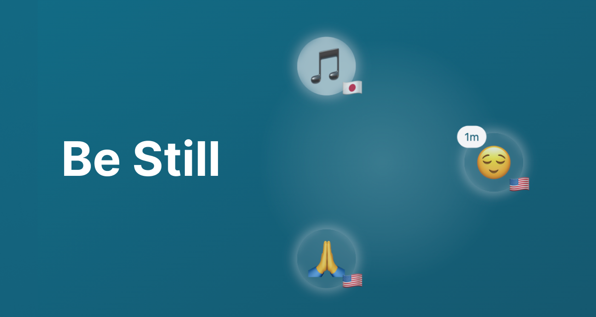

# Be Still, by faith.tools

A digital prayer room experience, inspired by real life prayer rooms, the Prayroom app, and the Salt + Light app.



[See the live demo](https://ft-be-still.netlify.app)

## Things to know

- Created via the Astro-based [Freedom Stack](https://github.com/cameronapak/freedom-stack) boilerplate. Visit that boilerplate for more information on how to use it and how to use this project.
- This project is deployed to Netlify.
- Uses Partykit backend for WebSocket-based communication.
- If you make changes to the Partykit backend, you will need to redeploy it.
- I think it can handle 100 concurrent connections, but I haven't tested it.

## Local Development

### Prerequisites
- A Groq API key (for AI features to help determine if a user's name is safe for public display)
- A Partykit account (for the WebSocket server)

### 1. Clone the repository

```bash
git clone https://github.com/cameronapak/be-still.git
```

### 2. Install dependencies

Must be using Node.js v20.3.0 or higher.

```bash
npm install
```

### 3. Set environment variables

Copy the `.env.example` file to `.env` and populate the variables.

```bash
cp .env.example .env
```

[Get your own Groq API key.](https://console.groq.com/keys)

### 4. Setup the Partykit backend. [Learn more](https://docs.partykit.io/reference/partykit-cli/#login)

```bash
npm run partykit:login
```

### 5. Run the development server

```bash
npm run dev
```

## Attribution License

[](https://copy.church/)

> This resource is freely given (Matt 10:8) for the sake of the gospel.

```txt
MIT No Attribution

Copyright 2024 Cameron Pak

Permission is hereby granted, free of charge, to any person obtaining a copy
of this software and associated documentation files (the "Software"), to deal
in the Software without restriction, including without limitation the rights
to use, copy, modify, merge, publish, distribute, sublicense, and/or sell
copies of the Software, and to permit persons to whom the Software is
furnished to do so.

THE SOFTWARE IS PROVIDED "AS IS", WITHOUT WARRANTY OF ANY KIND, EXPRESS OR
IMPLIED, INCLUDING BUT NOT LIMITED TO THE WARRANTIES OF MERCHANTABILITY,
FITNESS FOR A PARTICULAR PURPOSE AND NONINFRINGEMENT. IN NO EVENT SHALL THE
AUTHORS OR COPYRIGHT HOLDERS BE LIABLE FOR ANY CLAIM, DAMAGES OR OTHER
LIABILITY, WHETHER IN AN ACTION OF CONTRACT, TORT OR OTHERWISE, ARISING FROM,
OUT OF OR IN CONNECTION WITH THE SOFTWARE OR THE USE OR OTHER DEALINGS IN THE
SOFTWARE.
```

I hope this prompt empowers you to create Christian AI tools that bring people closer to God's word, their identity in Christ, and in fellowship with community

## Contributing

Create a fork of this repository, make your changes, and submit a pull request. 

## Questions?

Feel free to reach out to me on [X](https://x.com/cameronpak) if you have any questions!
